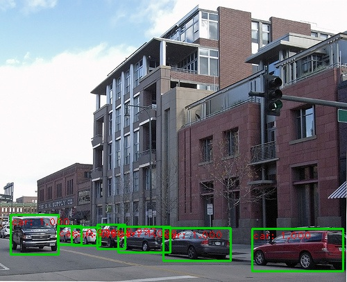
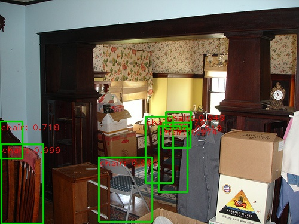

# A *Faster* Pytorch Implementation of Faster R-CNN

## Introduction

This project is a *faster* pytorch implementation of faster R-CNN, aimed to accelerating the training of faster R-CNN object detection models. Recently, there are a number of good implementations:

* [rbgirshick/py-faster-rcnn](https://github.com/rbgirshick/py-faster-rcnn), developed based on Pycaffe + Numpy

* [longcw/faster_rcnn_pytorch](https://github.com/longcw/faster_rcnn_pytorch), developed based on Pytorch + Numpy

* [endernewton/tf-faster-rcnn](https://github.com/endernewton/tf-faster-rcnn), developed based on TensorFlow + Numpy

* [ruotianluo/pytorch-faster-rcnn](https://github.com/ruotianluo/pytorch-faster-rcnn), developed based on Pytorch + TensorFlow + Numpy

During our implementing, we referred the above implementations, especailly [longcw/faster_rcnn_pytorch](https://github.com/longcw/faster_rcnn_pytorch). However, our implementation has several unique and new features compared with the above implementations:

* **It is pure Pytorch code**. We convert all the numpy implementations to pytorch!

* **It supports multi-image batch training**. We revise all the layers, including dataloader, rpn, roi-pooling, etc., to support multiple images in each minibatch.

* **It supports multiple GPUs training**. We use a multiple GPU wrapper (nn.DataParallel here) to make it flexible to use one or more GPUs, as a merit of the above two features.

* **It supports three pooling methods**. We integrate three pooling methods: roi pooing, roi align and roi crop. More importantly, we modify all of them to support multi-image batch training.

* **It is memory efficient**. We limit the image aspect ratio, and group images with similar aspect ratios into a minibatch. As such, we can train resnet101 and VGG16 with batchsize = 4 (4 images) on a sigle Titan X (12 GB). When training with 8 GPU, the maximum batchsize for each GPU is 3 (Res101), totally 24.

* **It is faster**. Based on the above modifications, the training is much faster. We report the training speed on NVIDIA TITAN Xp in the tables below.

## Other Implementations

* [Feature Pyramid Network (FPN)](https://github.com/jwyang/fpn.pytorch)

* [Mask R-CNN](https://github.com/roytseng-tw) (~~ongoing~~ already implemented by [roytseng-tw](https://github.com/roytseng-tw/mask-rcnn.pytorch))

## Tutorial

* [Blog](http://www.telesens.co/2018/03/11/object-detection-and-classification-using-r-cnns/) by [ankur6ue](https://github.com/ankur6ue)

## Benchmarking

We benchmark our code thoroughly on three datasets: pascal voc, coco and imagenet-200, using two different network architecture: vgg16 and resnet101. Below are the results:

1). PASCAL VOC 2007 (Train/Test: 07trainval/07test, scale=600, ROI Align)

model    | #GPUs | batch size | lr        | lr_decay | max_epoch     |  time/epoch | mem/GPU | mAP
---------|--------|-----|--------|-----|-----|-------|--------|-----
[VGG-16](https://www.dropbox.com/s/6ief4w7qzka6083/faster_rcnn_1_6_10021.pth?dl=0)     | 1 | 1 | 1e-3 | 5   | 6   |  0.76 hr | 3265MB   | 70.1
[VGG-16](https://www.dropbox.com/s/cpj2nu35am0f9hp/faster_rcnn_1_9_2504.pth?dl=0)     | 1 | 4 | 4e-3 | 8   | 9  |  0.50 hr | 9083MB   | 69.6
[VGG-16](https://www.dropbox.com/s/1a31y7vicby0kvy/faster_rcnn_1_10_625.pth?dl=0)     | 8 | 16| 1e-2 | 8   | 10  |  0.19 hr | 5291MB   | 69.4
[VGG-16](https://www.dropbox.com/s/hkj7i6mbhw9tq4k/faster_rcnn_1_11_416.pth?dl=0)     | 8 | 24| 1e-2 | 10  | 11  |  0.16 hr | 11303MB  | 69.2
[Res-101](https://www.dropbox.com/s/4v3or0054kzl19q/faster_rcnn_1_7_10021.pth?dl=0)   | 1 | 1 | 1e-3 | 5   | 7   |  0.88 hr | 3200 MB  | 75.2
[Res-101](https://www.dropbox.com/s/8bhldrds3mf0yuj/faster_rcnn_1_10_2504.pth?dl=0)    | 1 | 4 | 4e-3 | 8   | 10  |  0.60 hr | 9700 MB  | 74.9
[Res-101](https://www.dropbox.com/s/5is50y01m1l9hbu/faster_rcnn_1_10_625.pth?dl=0)    | 8 | 16| 1e-2 | 8   | 10  |  0.23 hr | 8400 MB  | 75.2 
[Res-101](https://www.dropbox.com/s/cn8gneumg4gjo9i/faster_rcnn_1_12_416.pth?dl=0)    | 8 | 24| 1e-2 | 10  | 12  |  0.17 hr | 10327MB  | 75.1  


2). COCO (Train/Test: coco_train+coco_val-minival/minival, scale=800, max_size=1200, ROI Align)

model     | #GPUs | batch size |lr        | lr_decay | max_epoch     |  time/epoch | mem/GPU | mAP
---------|--------|-----|--------|-----|-----|-------|--------|-----
VGG-16     | 8 | 16    |1e-2| 4   | 6  |  4.9 hr | 7192 MB  | 29.2
[Res-101](https://www.dropbox.com/s/5if6l7mqsi4rfk9/faster_rcnn_1_6_14657.pth?dl=0)    | 8 | 16    |1e-2| 4   | 6  |  6.0 hr    |10956 MB  | 36.2
[Res-101](https://www.dropbox.com/s/be0isevd22eikqb/faster_rcnn_1_10_14657.pth?dl=0)    | 8 | 16    |1e-2| 4   | 10  |  6.0 hr    |10956 MB  | 37.0

**NOTE**. Since the above models use scale=800, you need add "--ls" at the end of test command.

3). COCO (Train/Test: coco_train+coco_val-minival/minival, scale=600, max_size=1000, ROI Align)

model     | #GPUs | batch size |lr        | lr_decay | max_epoch     |  time/epoch | mem/GPU | mAP
---------|--------|-----|--------|-----|-----|-------|--------|-----
[Res-101](https://www.dropbox.com/s/y171ze1sdw1o2ph/faster_rcnn_1_6_9771.pth?dl=0)    | 8 | 24    |1e-2| 4   | 6  |  5.4 hr    |10659 MB  | 33.9
[Res-101](https://www.dropbox.com/s/dpq6qv0efspelr3/faster_rcnn_1_10_9771.pth?dl=0)    | 8 | 24    |1e-2| 4   | 10  |  5.4 hr    |10659 MB  | 34.5

4). Visual Genome (Train/Test: vg_train/vg_test, scale=600, max_size=1000, ROI Align, category=2500)

model     | #GPUs | batch size |lr        | lr_decay | max_epoch     |  time/epoch | mem/GPU | mAP
---------|--------|-----|--------|-----|-----|-------|--------|-----
[VGG-16](http://data.lip6.fr/cadene/faster-rcnn.pytorch/faster_rcnn_1_19_48611.pth)    | 1 P100 | 4    |1e-3| 5   | 20  |  3.7 hr    |12707 MB  | 4.4

Thanks to [Remi](https://github.com/Cadene) for providing the pretrained detection model on visual genome!

* Click the links in the above tables to download our pre-trained faster r-cnn models.
* If not mentioned, the GPU we used is NVIDIA Titan X Pascal (12GB).

### What we are going to do

- [x] Support both python2 and python3 (great thanks to [cclauss](https://github.com/cclauss)).
- [ ] Add deformable pooling layer as an alternative way for roi pooling (mainly supported by [Xander](https://github.com/xanderchf))
- [ ] ~~Run systematical experiments on PASCAL VOC 07/12, COCO, ImageNet, Visual Genome (VG) with different settings.~~
- [ ] ~~Write a detailed report about the new stuffs in our implementations, and the quantitative results in our experiments.~~

## Preparation


First of all, clone the code
```
git clone https://github.com/jwyang/faster-rcnn.pytorch.git
```

Then, create a folder:
```
cd faster-rcnn.pytorch && mkdir data
```

### prerequisites

* Python 2.7 or 3.6
* Pytorch 0.2.0 or higher
* CUDA 8.0 or higher

### Data Preparation

* **PASCAL_VOC 07+12**: Please follow the instructions in [py-faster-rcnn](https://github.com/rbgirshick/py-faster-rcnn#beyond-the-demo-installation-for-training-and-testing-models) to prepare VOC datasets. Actually, you can refer to any others. After downloading the data, creat softlinks in the folder data/.

* **COCO**: Please also follow the instructions in [py-faster-rcnn](https://github.com/rbgirshick/py-faster-rcnn#beyond-the-demo-installation-for-training-and-testing-models) to prepare the data.

* **Visual Genome**: Please follow the instructions in [bottom-up-attention](https://github.com/peteanderson80/bottom-up-attention) to prepare Visual Genome dataset. You need to download the images and object annotation files first, and then perform proprecessing to obtain the vocabulary and cleansed annotations based on the scripts provided in this repository.

### Pretrained Model

We used two pretrained models in our experiments, VGG and ResNet101. You can download these two models from:

* VGG16: [Dropbox](https://www.dropbox.com/s/s3brpk0bdq60nyb/vgg16_caffe.pth?dl=0), [VT Server](https://filebox.ece.vt.edu/~jw2yang/faster-rcnn/pretrained-base-models/vgg16_caffe.pth)

* ResNet101: [Dropbox](https://www.dropbox.com/s/iev3tkbz5wyyuz9/resnet101_caffe.pth?dl=0), [VT Server](https://filebox.ece.vt.edu/~jw2yang/faster-rcnn/pretrained-base-models/resnet101_caffe.pth)

Download them and put them into the data/pretrained_model/.

**NOTE**. We compare the pretrained models from Pytorch and Caffe, and surprisingly find Caffe pretrained models have slightly better performance than Pytorch pretrained. We would suggest to use Caffe pretrained models from the above link to reproduce our results.

**If you want to use pytorch pre-trained models, please remember to transpose images from BGR to RGB, and also use the same data transformer (minus mean and normalize) as used in pretrained model.**

### Compilation

As pointed out by [ruotianluo/pytorch-faster-rcnn](https://github.com/ruotianluo/pytorch-faster-rcnn), choose the right `-arch` in `make.sh` file, to compile the cuda code:

  | GPU model  | Architecture |
  | ------------- | ------------- |
  | TitanX (Maxwell/Pascal) | sm_52 |
  | GTX 960M | sm_50 |
  | GTX 1080 (Ti) | sm_61 |
  | Grid K520 (AWS g2.2xlarge) | sm_30 |
  | Tesla K80 (AWS p2.xlarge) | sm_37 |

More details about setting the architecture can be found [here](https://developer.nvidia.com/cuda-gpus) or [here](http://arnon.dk/matching-sm-architectures-arch-and-gencode-for-various-nvidia-cards/)

Install all the python dependencies using pip:
```
pip install -r requirements.txt
```

Compile the cuda dependencies using following simple commands:

```
cd lib
sh make.sh
```

It will compile all the modules you need, including NMS, ROI_Pooing, ROI_Align and ROI_Crop. The default version is compiled with Python 2.7, please compile by yourself if you are using a different python version.

**As pointed out in this [issue](https://github.com/jwyang/faster-rcnn.pytorch/issues/16), if you encounter some error during the compilation, you might miss to export the CUDA paths to your environment.**

## Train

Before training, set the right directory to save and load the trained models. Change the arguments "save_dir" and "load_dir" in trainval_net.py and test_net.py to adapt to your environment.

To train a faster R-CNN model with vgg16 on pascal_voc, simply run:
```
CUDA_VISIBLE_DEVICES=$GPU_ID python trainval_net.py \
                   --dataset pascal_voc --net vgg16 \
                   --bs $BATCH_SIZE --nw $WORKER_NUMBER \
                   --lr $LEARNING_RATE --lr_decay_step $DECAY_STEP \
                   --cuda
```
where 'bs' is the batch size with default 1. Alternatively, to train with resnet101 on pascal_voc, simple run:
```
 CUDA_VISIBLE_DEVICES=$GPU_ID python trainval_net.py \
                    --dataset pascal_voc --net res101 \
                    --bs $BATCH_SIZE --nw $WORKER_NUMBER \
                    --lr $LEARNING_RATE --lr_decay_step $DECAY_STEP \
                    --cuda
```
Above, BATCH_SIZE and WORKER_NUMBER can be set adaptively according to your GPU memory size. **On Titan Xp with 12G memory, it can be up to 4**.

If you have multiple (say 8) Titan Xp GPUs, then just use them all! Try:
```
python trainval_net.py --dataset pascal_voc --net vgg16 \
                       --bs 24 --nw 8 \
                       --lr $LEARNING_RATE --lr_decay_step $DECAY_STEP \
                       --cuda --mGPUs

```

Change dataset to "coco" or 'vg' if you want to train on COCO or Visual Genome.

## Test

If you want to evlauate the detection performance of a pre-trained vgg16 model on pascal_voc test set, simply run
```
python test_net.py --dataset pascal_voc --net vgg16 \
                   --checksession $SESSION --checkepoch $EPOCH --checkpoint $CHECKPOINT \
                   --cuda
```
Specify the specific model session, chechepoch and checkpoint, e.g., SESSION=1, EPOCH=6, CHECKPOINT=416.

## Demo

If you want to run detection on your own images with a pre-trained model, download the pretrained model listed in above tables or train your own models at first, then add images to folder $ROOT/images, and then run
```
python demo.py --net vgg16 \
               --checksession $SESSION --checkepoch $EPOCH --checkpoint $CHECKPOINT \
               --cuda --load_dir path/to/model/directoy
```

Then you will find the detection results in folder $ROOT/images.

**Note the default demo.py merely support pascal_voc categories. You need to change the [line](https://github.com/jwyang/faster-rcnn.pytorch/blob/530f3fdccaa60d05fa068bc2148695211586bd88/demo.py#L156) to adapt your own model.**

Below are some detection results:

<div style="color:#0000FF" align="center">
 
</div>

## Webcam Demo

You can use a webcam in a real-time demo by running
```
python demo.py --net vgg16 \
               --checksession $SESSION --checkepoch $EPOCH --checkpoint $CHECKPOINT \
               --cuda --load_dir path/to/model/directoy \
               --webcam $WEBCAM_ID
```
The demo is stopped by clicking the image window and then pressing the 'q' key.

## Authorship

This project is equally contributed by [Jianwei Yang](https://github.com/jwyang) and [Jiasen Lu](https://github.com/jiasenlu), and many others (thanks to them!).

## Citation

    @article{jjfaster2rcnn,
        Author = {Jianwei Yang and Jiasen Lu and Dhruv Batra and Devi Parikh},
        Title = {A Faster Pytorch Implementation of Faster R-CNN},
        Journal = {https://github.com/jwyang/faster-rcnn.pytorch},
        Year = {2017}
    }

    @inproceedings{renNIPS15fasterrcnn,
        Author = {Shaoqing Ren and Kaiming He and Ross Girshick and Jian Sun},
        Title = {Faster {R-CNN}: Towards Real-Time Object Detection
                 with Region Proposal Networks},
        Booktitle = {Advances in Neural Information Processing Systems ({NIPS})},
        Year = {2015}
    }
